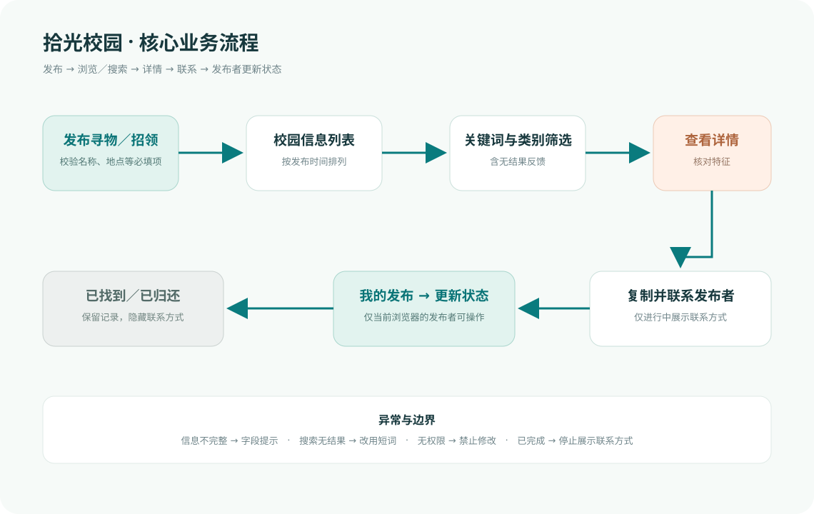
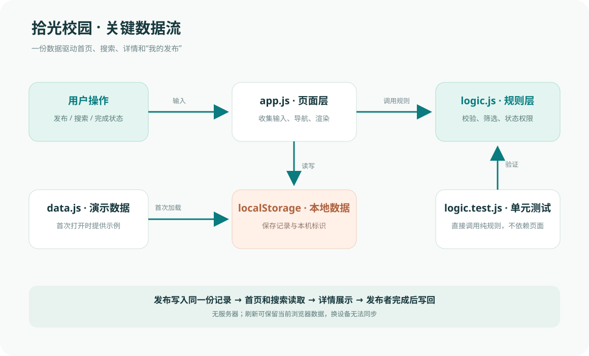
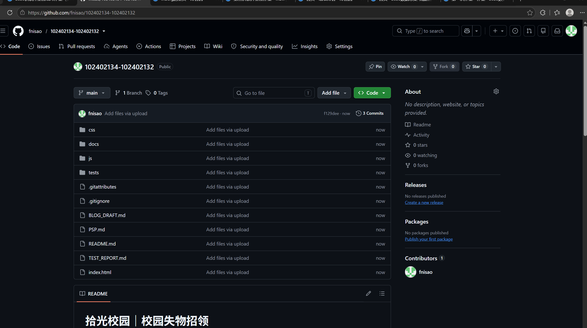
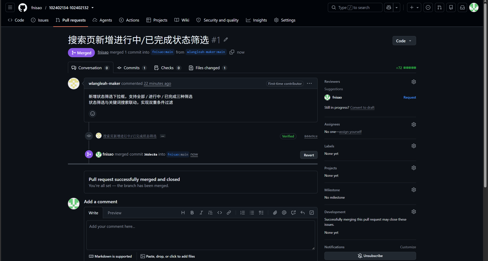

# 2026 秋软件工程第二次结对作业：拾光校园程序实现

> 这是一份供两位成员核对的博客底稿。发布前请替换「待填写／待实测」，完成真实 GitHub fork、Pull Request 和双方 PSP 记录。文中已插入仓库相对路径图片，粘贴到博客园时还需用博客园图片上传功能替换图片地址。

| 项目 | 内容 |
| --- | --- |
| 课程 | [H202601 软件工程与软件工程实践](https://edu.cnblogs.com/campus/fzu/2026-01SoftwareEngineeringandSoftwareEngineeringPractice) |
| 作业 | 2026 秋软件工程第二次结对作业之程序实现 |
| 结对成员 | 王世豪（102402134）、邱福铭（102402132） |
| 双方博客主页 | 王世豪：[待填写]；邱福铭：[待填写] |
| 本次作业博客 | [发布后补入本页地址] |
| GitHub 项目 | [102402134-102402132](https://github.com/fnisao/102402134-102402132) |
| 前序原型 | [拾光校园交互原型](https://award-arctic-21808768.figma.site/) |

## 一、项目目标与结对分工

上一次结对作业完成了“拾光校园”原型。本次把原型中的主线变成可运行的网页：同学可以发布寻物或招领，集中浏览信息，以关键词查找物品，查看详情与联系方式；物品找到或归还后，发布者能结束线索。我们选择无需服务器的本地网页，下载完整目录后可用 Chrome 直接打开。数据保存在当前浏览器，适合课程作业演示，但不能跨设备共享，无法解决真实校园范围的消息同步问题。

原型中的按钮跳转只表达交互意图。程序实现必须补齐数据动作：发布前校验，发布后保存；搜索要按当前数据过滤；完成状态写回数据后，所有列表与详情的展示同步变化。我们据此将需求拆成「输入和校验」「信息读取与搜索」「联系和状态更新」三个可独立检查的环节。

| 成员 | 实际负责内容与可核对证据 |
| --- | --- |
| 王世豪（102402134） | [双方按实际工作填写模块、文件及对应提交或 PR] |
| 邱福铭（102402132） | [双方按实际工作填写模块、文件及对应提交或 PR] |
| 共同完成 | [填写真实讨论、复审和手工测试记录] |

## 二、PSP：先估时，完成后记实

预估以**两人合计的人分钟**记录于编码前。由于双方尚未提供逐阶段计时记录，右列为根据当前代码、文档、测试和 Edge 走查过程填入的**事后回顾估算**，不是计时实测。Chrome 验收、GitHub 协作与博客发布尚未完成，不包含在下列数字内。两位成员确认后才能把右列改称“实际耗时”。

| PSP 阶段 | 预估／分钟 | 已完成工作的回顾估算／分钟 |
| --- | ---: | ---: |
| Planning：计划与任务拆解 | 30 | 25 |
| Estimate：估算与分工 | 20 | 15 |
| Analysis：需求分析和原型复核 | 50 | 60 |
| Design Spec：数据结构和流程文档 | 45 | 40 |
| Design Review：方案复审 | 30 | 25 |
| Coding Standard：代码规范 | 20 | 15 |
| Design：界面及交互设计 | 90 | 90 |
| Coding：页面、逻辑及数据存储 | 360 | 310 |
| Code Review：代码复审 | 60 | 50 |
| Test：自动化和手工测试、修正 | 150 | 180 |
| Reporting：README 与博客 | 100 | 120 |
| Test Report：测试报告 | 35 | 50 |
| Size Measurement：工作量统计 | 20 | 10 |
| Postmortem：回顾与改进 | 30 | 30 |
| **合计** | **1040** | **1020（回顾估算）** |

回顾估算比预估少 20 分钟。编码阶段少 50 分钟，与复用前序原型的结构有关；测试多 30 分钟，是因为另行核对了空表单、搜索与详情等浏览器画面；报告和测试报告分别多 20、15 分钟，用于补充流程图、数据流图、代码解释与截图。这个解释仅对应目前能看到的工作成果。具体计时口径见仓库 `PSP.md`；正式提交前应由双方核对各自投入，并把剩余工作计入。

## 三、解题思路与设计实现

### 3.1 从原型收敛功能

前序原型有首页、发布、搜索、结果、详情、成功提示和“我的发布”。实现时，我们按一条信息的生命周期组织功能：

```text
发布者填写寻物／招领
       ↓ 校验字段
保存为「进行中」 → 首页按时间浏览
       ↓                 ↓
我的发布          关键词／类型／类别搜索
       └────────→ 详情 → 查看并复制联系方式
                        ↓ 线下核对并联系
发布者回到「我的发布」→ 标记「已找到／已归还」
                        ↓
              列表保留状态，详情隐藏联系方式
```



图 1 说明联系之后如何结束线索，以及由谁操作。发布字段不完整时返回表单错误；没有匹配线索时显示空结果；只有当前浏览器标识与发布记录一致时，才出现并允许完成操作。图中文字和箭头与实际实现中的 `createPost`、`filterPosts`、`updateStatus` 对应。

### 3.2 数据与状态

每条信息包含 `id`、`ownerId`、`kind`（lost/found）、名称、类别、日期、地点、描述、联系方式、`status`（active/done）及创建时间。`js/logic.js` 专管规则，`js/app.js` 专管页面和事件，`js/data.js` 提供四条明确标为虚构的演示信息。所有新记录保存在浏览器 `localStorage` 中，刷新页面后可继续查看。这个版本没有用户账号；“发布者”由当前浏览器保存的随机标识区分，不能用作真实身份验证。

| 约束或需求 | 实现决定 | 对测试人员的影响 |
| --- | --- | --- |
下载文件后直接打开 `index.html` | 使用原生 HTML、CSS、普通脚本；不依赖构建工具、CDN 或服务器 | 网页本身不需安装 Node.js |
同一条信息在多个页面出现 | `logic.js` 返回统一筛选结果，`app.js` 从同一个 `posts` 数组渲染 | 状态更新后可从列表、搜索和详情核对 |
没有账号与后端 | 用 `localStorage` 保存记录及本机标识 | 当前浏览器可刷新保留；跨设备不共享 |
测试核心规则 | 规则函数不依赖 DOM 或本地存储 | 用 Node.js 内置测试器直接验证 |



发布链路为「表单 → `validatePost` → `createPost` → 本地保存 → 成功页」；读取链路为「本地数据 → `filterPosts` → 卡片／详情」。初次打开时，`data.js` 提供演示信息。搜索、状态权限等规则在 `logic.js` 集中维护，避免多个页面各写一套判断。

### 3.3 关键代码

发布校验返回按字段命名的错误，页面据此把提示放在对应输入框下方。例如日期检查既排除 2 月 30 日，也排除未来日期：

```js
if (!/^\d{4}-\d{2}-\d{2}$/.test(clean(input.occurredAt))) {
  errors.occurredAt = "请选择日期";
} else {
  const [year, month, day] = input.occurredAt.split("-").map(Number);
  const parsed = new Date(year, month - 1, day);
  if (parsed.getFullYear() !== year || parsed.getMonth() !== month - 1 || parsed.getDate() !== day) {
    errors.occurredAt = "日期无效";
  } else if (parsed > new Date(new Date().toDateString())) {
    errors.occurredAt = "日期不能晚于今天";
  }
}
```

空表单的 Edge 初测结果见图 3：名称、类别、日期、地点和描述错误同时出现，避免用户逐项猜测哪里填错。截图未覆盖联系方式字段，所以该字段的浏览器表现仍需继续走查。


发布状态只能由当前浏览器中创建该信息的发布者修改，重复完成也被拒绝：

```js
function updateStatus(posts, id, ownerId) {
  const index = posts.findIndex((post) => post.id === id);
  if (index < 0) return { ok: false, reason: "not-found" };
  if (posts[index].ownerId !== ownerId) return { ok: false, reason: "forbidden" };
  if (posts[index].status === "done") return { ok: false, reason: "already-done" };
  const next = posts.map((post, i) => i === index ? { ...post, status: "done" } : post);
  return { ok: true, posts: next };
}
```

图 4 从“我的发布”进入新发布的“深蓝色折叠伞”详情，标题、描述、类别、日期、地点、联系方式和“标记为已找到”入口都可见。截图只证明操作入口与当前状态，尚未证明按钮点击后的状态变化。


搜索把名称、类别、地点、描述统一转成可检索文字，再叠加类型、类别、状态与发布者筛选，最后按发布时间排序。这让“雨伞”“图书馆”“蓝色伞面”等不同线索都能用于查找。关键的组合过滤如下：

```js
if (options.kind && options.kind !== "all" && post.kind !== options.kind) return false;
if (options.category && options.category !== "all" && post.category !== options.category) return false;
if (options.status && options.status !== "all" && post.status !== options.status) return false;
if (options.ownerId && post.ownerId !== options.ownerId) return false;
const text = [post.title, post.category, post.location, post.description]
  .join(" ").toLocaleLowerCase("zh-CN");
return !keyword || text.includes(keyword);
```

各条件采用“同时满足”的关系。找不到结果时，界面会显示空态及“清除筛选”入口，便于用户换关键词重试。

图 5 使用关键词“卡”得到 1 条招领结果，卡片标题、地点和“待认领”状态与演示数据一致。关键词和类别同时筛选、无结果时的反馈还需继续测试。


页面动态插入用户文本时调用 `escapeHTML`，将 `& < > " '` 转义为文本，避免把名称或描述中的 HTML 当作页面标签执行。发布校验还检查字段长度、类别、日期是否存在及是否晚于今天。

## 四、附加特点

1. **组合筛选与空结果引导。** 关键词搜索之外，可以按寻物／招领和物品类别筛选；无匹配时展示清除筛选入口。实现上复用同一个 `filterPosts`，减少首页与搜索页规则不一致的风险。
2. **完成后自动隐藏联系方式。** 发布者标记“已找到”或“已归还”后，列表仍展示已完成状态以减少重复寻找，详情不再显示联系方式。实现上由 `visibleContact` 根据状态控制，单元测试覆盖了进行中与已完成两条分支。
3. **一键复制与隐私提示。** 详情页支持复制联系方式；发布页提示不要写出完整校园卡号或证件号码，联系前先核对特征。本地文件环境下，现代剪贴板接口可能不可用，因此实现了旧接口的备用路径。两条路径都失败时会提示手动复制，不会假称成功。以下为当前代码中的备用逻辑，实际浏览器测试仍待完成：

```js
const helper = document.createElement("textarea");
helper.value = value;
helper.setAttribute("readonly", "");
helper.style.cssText = "position:fixed;left:-9999px;top:0;opacity:0";
document.body.appendChild(helper);
helper.select();
try { return document.execCommand("copy"); }
catch { return false; }
finally { helper.remove(); }
```

4. **响应式视觉与详情辨识。** 延续原型中寻物青绿、招领暖橙的配色，以独立品牌侧栏、线索卡片和移动端底部导航呈现。图 6 的招领详情使用暖色标题区域，展示“透明卡套的校园卡”的虚构演示联系方式 `demo_card`；用户可通过颜色、类型标签与状态文字辨识信息。图 7、图 8 分别是首页和发布成功页。这些都是 Edge 初测证据，不等同于最终 Chrome 验收。


复制反馈、“我的发布”列表、完成状态、刷新保留和窄屏布局的截图：[完成对应操作并实测后补入]。

## 五、目录与运行说明

```text
├─ index.html            网页入口
├─ css/style.css         响应式样式
├─ js/logic.js           发布、筛选和状态规则
├─ js/data.js            虚构演示数据
├─ js/app.js             页面与本地保存
├─ tests/logic.test.js   自动化测试（不必上传也可保留）
├─ docs/flow.svg         业务流程图
├─ docs/data-flow.svg    关键数据流图
├─ docs/screenshots/     测试与页面截图
├─ PSP.md                预估与事后估算（待核对）
├─ TEST_REPORT.md        测试方案和结果
└─ README.md             使用说明
```

测试人员下载仓库全部文件并保持目录结构，用 **Google Chrome** 打开 `index.html`。不需要安装框架、运行服务器或联网。首页查看演示信息；通过“发布”填写新线索；“搜索”输入名称、地点或特征；点击卡片查看详情、复制联系方式；在“我的发布”里打开本人信息并标记完成。若删除浏览器本地数据或换设备，已发布信息不会同步。我们先用 Edge 对首页、空表单、发布成功、关键词搜索与详情做了初测；复制反馈、完成状态、刷新持久化及 Chrome 复核仍待进行。

推荐用一条**虚构**数据完整走查：发布“测试用蓝色雨伞” → 搜索“蓝色雨伞” → 打开详情核对日期、地点、描述及联系方式 → 在“我的发布”标记“已找到” → 返回详情确认联系方式隐藏 → 刷新确认状态保留。若输入不存在的关键词，应出现空结果提示。测试记录和截图放在 `TEST_REPORT.md` 与 `docs/screenshots/`。

## 六、单元测试与测试数据

测试采用 Node.js 内置 `node:test` 和 `node:assert/strict`，无需安装 npm 依赖。学习步骤是：先把可测试的业务规则与 DOM 分离，再给每个条件分支构造输入，调用函数后对返回值断言。简易运行教程：

1. 安装 Node.js 18 或更新版本；终端进入项目根目录。
2. 运行 `node --test tests/logic.test.js`。
3. 查看末尾的 `tests`、`pass`、`fail`；若失败，根据 T 编号定位 `tests/logic.test.js`。

例如，非发布者不应修改状态：

```js
test("T12: another visitor cannot change a post's status", () => {
  const result = L.updateStatus([make()], "one", "bob");
  assert.deepEqual(result, { ok: false, reason: "forbidden" });
});
```

测试数据以一条合法寻物记录为基准，每次只改一个字段或条件：空名称、短描述、未知类别、无效日期用于失败分支；两条发布时间不同的记录用于排序；不同发布者和状态用于权限及组合筛选。这样可看出失败由哪一个输入引起。还加入恶意 HTML 字符与损坏记录，避免只测顺利路径。完整 18 个用例见 `tests/logic.test.js` 和 `TEST_REPORT.md`。

截至 2026-10-09，单元测试执行结果为 **18 通过、0 失败**。这属于规则层测试；页面点击、浏览器本地保存、剪贴板和窄屏排版需要继续按手工清单验收。单元测试再全绿，也不能证明界面元素在实际浏览器里一定可见、可点击。


发布到博客园时，请逐张上传本文图片并替换生成的地址；仓库相对路径不能直接用作博客园图片地址。

## 七、GitHub 协作、问题与结对体会

### GitHub 签入

仓库现为 [fnisao/102402134-102402132](https://github.com/fnisao/102402134-102402132)。GitHub 帐号 `wlangleah-maker` 从 Fork 提交了[搜索页状态筛选 PR #1](https://github.com/fnisao/102402134-102402132/pull/1)，仓库所有者已于 2026-10-09 合并。首次通过网页上传时误把外层准备文件夹一同上传，随后删除该目录并重新将项目文件放在仓库根目录；这些纠错提交应如实说明，不能写成分阶段功能开发。正式发布博客前，仍需补上完整提交历史截图，并由双方核对 GitHub 帐号与实际分工。





### 实际问题与解决

**问题 1：日期上限与本地“今天”不一致。** 初版表单用 `toISOString().slice(0, 10)` 设置日期上限；这个值按 UTC 取日期，在中国时区午夜附近可能落后于本地日期。修正为用本地年月日生成 `max`，规则层同时检查无效日期与未来日期。收获是日期输入的展示和校验要使用一致的本地日历口径。

**问题 2：复制功能在本地文件环境可能失效。** 浏览器可能不给 `file://` 页面提供 `navigator.clipboard`。实现中增加 `document.execCommand("copy")` 备用路径，并在两种方式都失败时明确提示手动复制。这个修正来自对交付方式的复核；尚需在最终测试浏览器中验证按钮反馈，不能把代码改动写成已经通过手工验收。

**问题 3：本地保存数据损坏后的恢复。** 初版读取到格式错误的 JSON 时，会把存储整体视为不可用；之后即使浏览器允许保存，新发布信息也无法持久化。现改为区分“读取权限失败”和“已有数据格式损坏”：前者提示临时会话，后者展示演示信息并提示下一次发布会覆盖异常数据。正常路径的自动化测试已通过，损坏数据的浏览器恢复流程仍需手工验证。

**问题 4：PR 合并后的状态筛选没有接入原搜索页。** PR #1 在 `index.html` 中另起脚本，用不存在的搜索框与列表选择器寻找页面节点，因此下拉框无法正常出现；它还只处理演示数据。复审后在本地把状态条件直接接入 `js/app.js` 的搜索页与现有 `filterPosts` 规则，并删除无效的独立脚本。代码修正已通过原有 18 项单元测试；GitHub 更新与 Chrome 手工验收完成前，不把此项写成已交付功能。

关于两人协作中实际遇到的问题、尝试与解决，请在共同开发后补充，不要照搬参考作业中的经历。

### 队友评价

以下评价以**上一轮结对原型作业已有的分工记录**为依据，是邱福铭对王世豪的评价草稿；当前程序实现中的具体协作、提交和复审情况还需两人核对。

- **值得学习：**上轮原型中，王世豪负责需求分析、流程图与报告整合，先把“发布—搜索—详情—状态更新”的范围梳理清楚。前序报告还记录了两人对聊天、定位等功能的取舍。这种先确定边界再推进页面的做法，使本次代码可以围绕同一条信息生命周期组织。
- **可以改进：**在程序实现阶段，建议更早共同确认数据字段、测试分工和 GitHub 提交安排，并及时记下 PSP 各阶段耗时。这样后期整合报告时，能直接用实际记录说明谁做了什么、在哪一步发生了返工。
- **本人收获：**这次把原型中的“点击即成功”改成了需要校验、保存和更新状态的程序流程；单元测试能验证规则，而 Edge 截图又帮助检查用户实际看到的页面。后续还需要完成 Chrome 复核和完整状态流转测试。

## 八、提交前核对

- [ ] 两位成员完成 Chrome 手工验收，补实际页面截图。
- [ ] 双方核对 PSP 回顾估算，加入尚未完成工作的时间，再决定是否能称为“实际耗时”。
- [ ] 填写双方博客、本篇博客和真实 GitHub 仓库地址。
- [ ] PR #1 已合并；补仓库与 PR 截图，完成状态筛选修正的 GitHub 提交及 Chrome 验收。
- [ ] 补充真实分工、结对困难，并由本人核对队友评价草稿。
- [ ] 截止前按课程要求填写结对统计表及 GitHub 地址。
