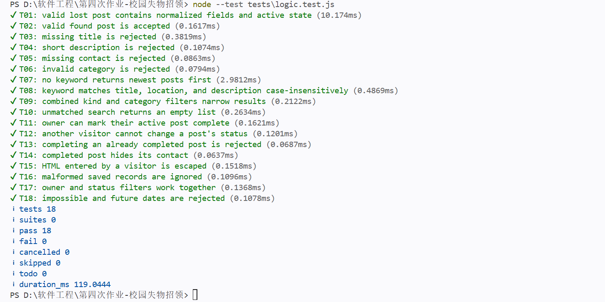
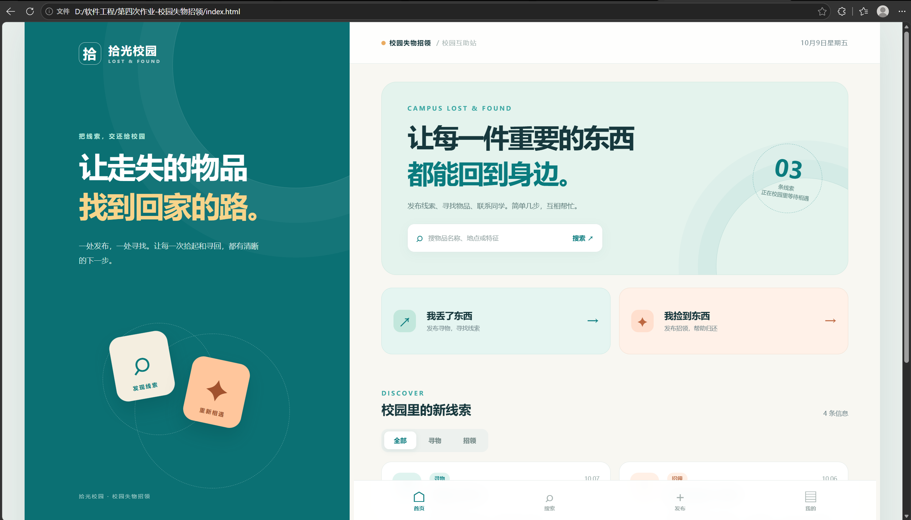
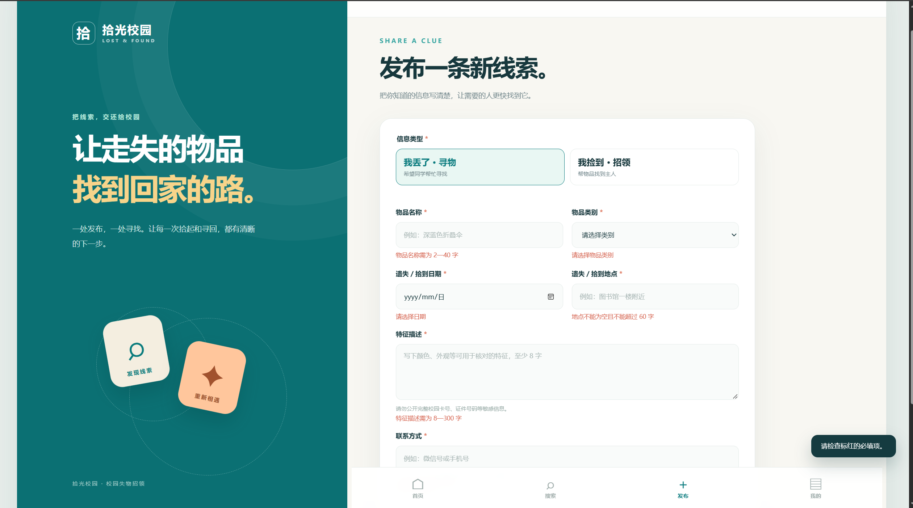
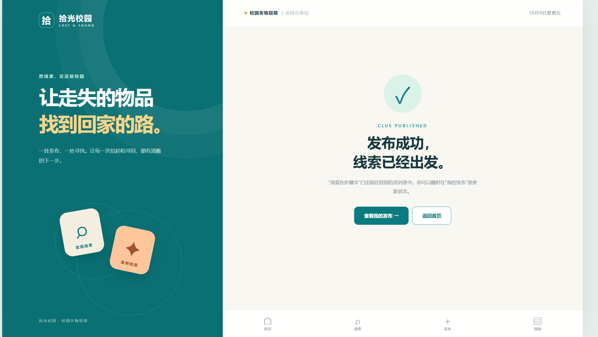
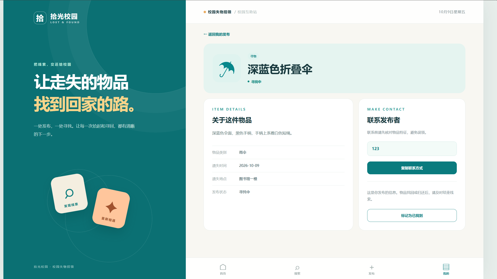
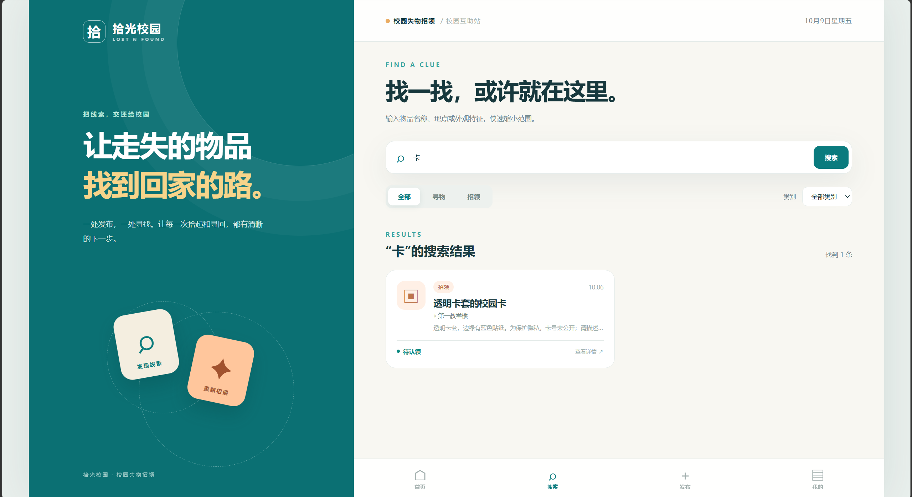
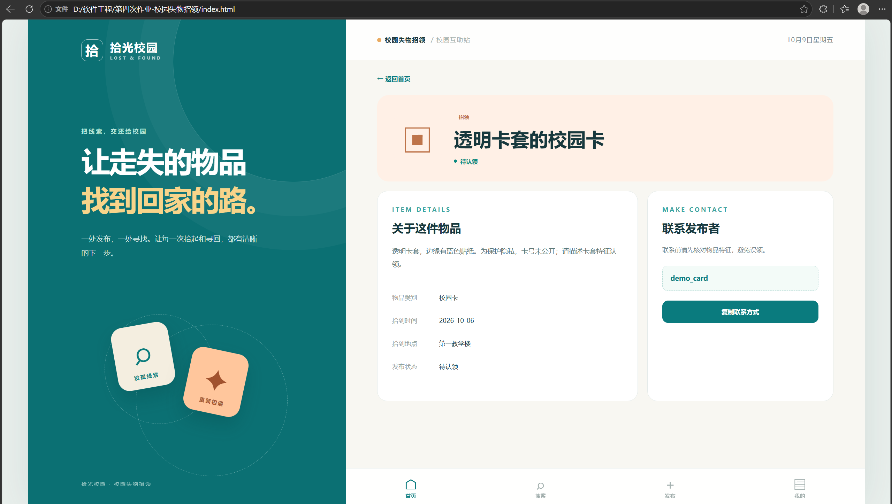

# 测试报告

## 环境与方法

- 被测对象：`js/logic.js` 的发布校验、搜索筛选、状态更新、联系方式展示及 HTML 转义。
- 工具：Node.js 内置 `node:test` 与 `node:assert/strict`，测试文件为 `tests/logic.test.js`。
- 命令：在项目根目录运行 `node --test tests/logic.test.js`。
- 方法：依据条件分支设计白盒用例，同时补充有效值、无效值、边界值和组合条件。

## 用例

| 编号 | 目标分支或场景 | 预期 |
| --- | --- | --- |
| T01 | 有效寻物信息及空格整理 | 创建成功，状态为进行中 |
| T02 | 有效招领信息 | 创建成功，类型为招领 |
| T03 | 物品名称为空 | 拒绝并返回名称错误 |
| T04 | 描述少于 8 字 | 拒绝并返回描述错误 |
| T05 | 联系方式为空 | 拒绝并返回联系方式错误 |
| T06 | 类别不在允许范围 | 拒绝并返回类别错误 |
| T07 | 无搜索词 | 按发布时间由新到旧排列 |
| T08 | 标题、地点、描述命中 | 正确返回匹配信息 |
| T09 | 类型与类别组合筛选 | 只返回两条件均匹配的信息 |
| T10 | 搜索无匹配 | 返回空数组 |
| T11 | 发布者更新状态 | 成功标记为完成 |
| T12 | 非发布者更新状态 | 拒绝修改 |
| T13 | 重复完成 | 拒绝重复修改 |
| T14 | 完成后读取联系方式 | 返回空值 |
| T15 | 用户输入 HTML 特殊字符 | 转义后显示为普通文字 |
| T16 | 本地存储记录结构错误 | 判定无效并忽略 |
| T17 | 发布者和状态组合筛选 | 只返回该发布者的指定状态 |
| T18 | 不存在或未来日期 | 拒绝发布 |

2026-10-08 在当前开发环境执行上述命令：**18 个通过，0 个失败**。自动化用例覆盖核心规则；浏览器中的完整点击流程仍应在实际提交环境用 Google Chrome 按 README 手工走查，并记录结果，不应把单元测试写成已完成的浏览器验收。

## 手工验收清单

| 步骤 | 操作 | 观察点 | 记录 |
| --- | --- | --- | --- |
| 1 | 用 Chrome 直接打开 `index.html` | 页面无乱码，四条演示信息可见 | 2026-10-09 Edge 初测：中文、首页布局、发布入口和导航正常，显示“4 条信息”；卡片内容仅部分入镜，需滚动核对；Chrome 待测 |
| 2 | 发布寻物，留空必填项 | 对应字段显示错误，不产生新记录 | 2026-10-09 Edge 初测：名称、类别、日期、地点、描述的错误及总提示可见；联系方式错误与列表未新增记录尚未入镜核对 |
| 3 | 填写完整表单并发布 | 出现成功页，“我的发布”出现新记录 | 2026-10-09 Edge 初测：成功页出现；从“我的发布”进入的“深蓝色折叠伞”详情包含标题、描述、类别、日期、地点和联系方式；列表页本身未入镜 |
| 4 | 搜索新物品名称并点开详情 | 关键词结果和详情与发布内容一致 | 2026-10-09 Edge 部分验证：关键词“卡”命中 1 条演示招领信息；另有该招领详情截图，但详情从首页进入，搜索结果到详情的连续点击仍待核对 |
| 5 | 复制联系方式 | 成功提示或可手动复制 | 2026-10-09 Edge 初测：详情页显示虚构演示联系方式及复制按钮；点击反馈与剪贴板内容待测 |
| 6 | 从“我的发布”标记完成 | 状态更新，详情联系方式隐藏 | 待实测 |
| 7 | 刷新页面 | 新记录与完成状态仍保留 | 待实测 |
| 8 | 搜索不存在的词 | 显示空结果提示，可清除筛选 | 待实测 |
| 9 | 缩小窗口至手机宽度 | 导航、表单和卡片未溢出 | 待实测 |
| 10 | 在搜索页切换全部状态／进行中／已完成，并与关键词、类别组合 | 结果数量和状态正确；新发布信息也参与筛选；清除筛选后恢复全部结果 | 待 Chrome 实测 |

## 测试评价

### 已完成的 Edge 初测截图

此图只记录 Edge 中可见的首页区域，不代表已完成 Chrome 验收或全部功能走查。

空表单截图覆盖了表单的上半部分；底部联系方式错误和列表状态仍需滚动核对。

成功页证明表单通过校验并进入下一页；下一张“我的发布”详情截图进一步展示了标题、日期、地点、描述和联系方式。

“返回我的发布”入口、本人状态更新按钮及所填信息均可见；此图没有显示完成后的状态。

关键词命中结果与演示数据一致，组合筛选和空结果仍需走查。

招领详情显示标题、特征、地点、日期与虚构联系方式。此详情页截图的返回入口为“返回首页”，所以不能拿它证明从搜索结果进入详情的连续流程。

测试覆盖 `validatePost`、`filterPosts`、`updateStatus`、`visibleContact` 的主要分支及部分边界，能较快发现发布与搜索规则的回归。它不能替代 Chrome 中的 DOM 事件、`localStorage`、剪贴板和响应式布局验收；这些需按上表完成实际走查。2026-10-09 参考同类作业后增加了本地文件环境的复制备用路径，并修正了损坏存储导致后续无法保存的问题；两条修正的浏览器验收尚未完成。由于项目没有账号或服务器，权限只基于当前浏览器保存的标识，不能作为真实身份认证。
